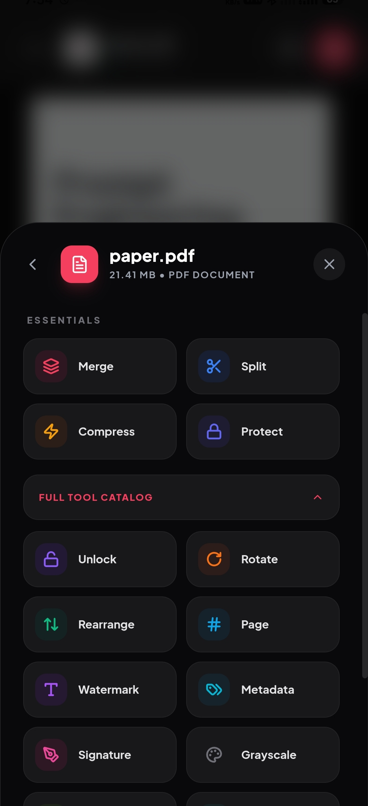

<p align="center">
  
</p>

# PaperKnife

**A simple, honest PDF utility that respects your privacy.**

[](LICENSE)
[](https://github.com/kalki-kgp/PaperKnife/stargazers)
[](https://kalki-kgp.github.io/PaperKnife/)
[](https://github.com/kalki-kgp/PaperKnife/releases/latest)
[](https://x.com/kalki-kgp)

---

## Preview

<p align="center">
  
  
</p>

---

### Why I built this

Most PDF websites ask you to upload your sensitive documents—bank statements, IDs, contracts—to their servers. Even if they promise to delete them, your data still leaves your device and travels across the internet.

I built **PaperKnife** to solve this. It's a collection of tools that run entirely in your browser or on your phone. Your files never leave your memory, they aren't stored in any database, and no server ever sees them. It works 100% offline.

### What it can do

*   **Modify:** Merge multiple files, split pages, rotate, and rearrange.
*   **Optimize:** Reduce file size with different quality presets.
*   **Secure:** Encrypt files with passwords or remove them locally.
*   **Convert:** Convert between PDF and images (JPG/PNG) or plain text.
*   **Sign:** Add an electronic signature to your documents safely.
*   **Sanitize:** Deep clean metadata (like Author or Producer) to keep your files anonymous.

### How to use it

*   **On Android:** Download the [latest APK](https://github.com/kalki-kgp/PaperKnife/releases/latest) or get it from:

[](https://apt.izzysoft.de/packages/com.paperknife.app)

*   **On the Web:** Visit the [live site](https://kalki-kgp.github.io/PaperKnife/). You can use it like any other website, or "install" it as a PWA for offline access.

---

### Support the project

PaperKnife is a solo project. It's open-source, ad-free, and tracker-free because I believe privacy is a right, not a luxury.

If this tool has saved you time or kept your data safe, please consider:
*   **Sponsoring:** Support development via [GitHub Sponsors](https://github.com/sponsors/kalki-kgp).
*   **Giving a Star:** It helps other people find the project.
*   **Spreading the word:** Share it with anyone who handles sensitive documents.

---

### Deployment

PaperKnife uses **BrowserRouter** for SEO-friendly URLs (e.g., `paperknife.app/merge` instead of `paperknife.app/#/merge`). This means your server must return `index.html` for all routes — otherwise direct navigation to `/merge`, `/split`, etc. will 404.

#### Quick start (local or VPS)

```bash
# 1. Install dependencies
bun install        # or npm install

# 2. Build for production
bun run build      # outputs to dist/

# 3. Serve with SPA fallback
npx serve -s dist -l 3000
```

The `-s` (single-page) flag tells `serve` to rewrite all routes to `index.html`, which is exactly what BrowserRouter needs.

#### With Cloudflare Tunnel

If you're using `cloudflared` to expose a local server:

```yaml
# ~/.cloudflared/config.yml
ingress:
  - hostname: paperknife.app
    service: http://localhost:3000
  - service: http_status:404
```

Then run:

```bash
npx serve -s dist -l 3000   # SPA-aware static server
cloudflared tunnel run       # expose to the internet
```

#### With Nginx

```nginx
server {
    listen 80;
    server_name paperknife.app;
    root /path/to/dist;
    index index.html;

    location / {
        try_files $uri $uri/ /index.html;
    }

    # Cache hashed assets aggressively
    location /assets/ {
        expires 1y;
        add_header Cache-Control "public, immutable";
    }
}
```

#### With Docker

```dockerfile
FROM node:20-alpine AS build
WORKDIR /app
COPY package.json bun.lock ./
RUN npm install
COPY . .
RUN npm run build

FROM node:20-alpine
RUN npm install -g serve
COPY --from=build /app/dist /app/dist
EXPOSE 3000
CMD ["serve", "-s", "/app/dist", "-l", "3000"]
```

#### Android APK

The Android build still uses **HashRouter** automatically (detected via Capacitor). No server-side config needed — the APK works offline.

```bash
bun run build
npx cap sync android
npx cap open android    # opens Android Studio
```

#### Environment Variables

| Variable | Default | Description |
|----------|---------|-------------|
| `VITE_BASE` | `/` | Base path for asset URLs (change for GitHub Pages: `./`) |
| `VITE_DISABLE_OCR` | `false` | Set to `true` to remove the PDF-to-Text tool (reduces bundle size) |

---

### Under the hood

PaperKnife is built with **React** and **TypeScript**. The core processing is handled by **pdf-lib** and **pdfjs-dist**, which run in a sandboxed environment using WebAssembly. The Android version is powered by **Capacitor**.

This project is licensed under the **GNU AGPL v3** to ensure it remains open and transparent forever.

---
*Made with care by [kalki-kgp](https://github.com/kalki-kgp)*
